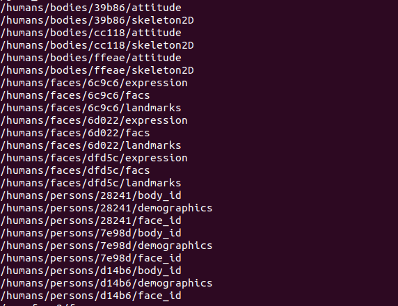

hri_matcher
=============

A ROS node that matches the facial and skeletal data in real-time to their known region in interest using OpenVino's re-identification model. Afterwards, a unique person id is generated and assigned to that person's facial and skeletal ids. If either the facial or skeletal facial stopped being detected, the matcher will publish the last detected message. 

The detection relies on the open-source [Intel OpenVINO toolkit](https://docs.openvinotoolkit.org/),


Installation
------------

- Follow first the general [ROS4HRI installation instructions](https://github.com/ros4hri/ros4hri/blob/master/README.md).

- Install the [`hri_msgs` package](https://github.com/ros4hri/hri_msgs/blob/master/README.md)

- Install the [`hri_faces` package](https://github.com/ros4hri/hri_faces/blob/master/README.md)

-  Install the [`hri_skeletons` package](https://github.com/ros4hri/hri_skeletons/blob/master/README.md)

- then:

```
$ cd ~/src
$ git clone https://git.brl.ac.uk/ROS4HRI/hri_matcher.git
$ cd hri_matcher
$ mkdir build && cd build
$ cmake -DCMAKE_BUILD_TYPE=Release -DCMAKE_INSTALL_PREFIX=~/dev .. && make && make install
```

You can test this node by running:
```
$ roslaunch video_stream_opencv camera.launch video_stream_provider:=0 camera_name:=camera
$ roslaunch hri_matcher hri_matcher
$ rostopic list
```

which should display something like that if there are three people in the frame:



